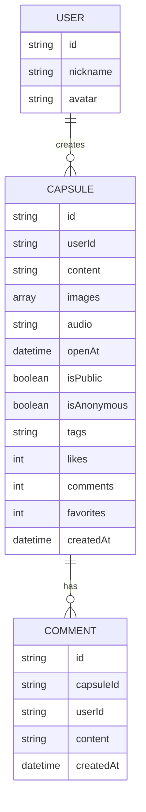

# 校园趣味时光胶囊网站 - 技术架构文档

## 1. Architecture Design

```mermaid
graph TB
    subgraph "Frontend"
        A[React App]
        B[Pages - 胶囊广场/创建/我的/详情]
        C[Components - 胶囊卡片/表单/播放器]
        D[State Management - Zustand]
    end
    
    subgraph "Data Storage"
        E[LocalStorage - 用户数据/胶囊数据]
    end
    
    subgraph "Assets"
        F[图片 - Base64 存储]
        G[语音 - Web Audio API]
    end
    
    A --&gt; B
    A --&gt; C
    A --&gt; D
    D --&gt; E
    B --&gt; F
    B --&gt; G
```

## 2. Technology Description

- **Frontend**: React@18 + TypeScript + Vite
- **Styling**: Tailwind CSS@3
- **State Management**: Zustand
- **UI Icons**: Lucide React
- **Router**: React Router DOM@6
- **Storage**: LocalStorage (本地存储用户和胶囊数据)
- **Media**: Web Audio API (语音录制) + File API (图片处理)
- **Initialization Tool**: vite-init

## 3. Route Definitions

| Route | Purpose |
|-------|---------|
| / | 胶囊广场首页 |
| /create | 创建时光胶囊页面 |
| /my-capsules | 我的胶囊页面 |
| /capsule/:id | 胶囊详情页面 |

## 4. Data Model

### 4.1 Data Model Definition



### 4.2 TypeScript Type Definitions

```typescript
interface User {
  id: string;
  nickname: string;
  avatar?: string;
}

interface Capsule {
  id: string;
  userId: string;
  content: string;
  images: string[];
  audio?: string;
  openAt: Date;
  isPublic: boolean;
  isAnonymous: boolean;
  tags: string[];
  likes: number;
  comments: number;
  favorites: number;
  createdAt: Date;
}

interface Comment {
  id: string;
  capsuleId: string;
  userId: string;
  nickname: string;
  content: string;
  createdAt: Date;
}

interface CapsuleStore {
  capsules: Capsule[];
  comments: Record&lt;string, Comment[]&gt;;
  currentUser: User | null;
  addCapsule: (capsule: Omit&lt;Capsule, 'id' | 'likes' | 'comments' | 'favorites' | 'createdAt'&gt;) =&gt; void;
  likeCapsule: (id: string) =&gt; void;
  addComment: (capsuleId: string, comment: Omit&lt;Comment, 'id' | 'createdAt'&gt;) =&gt; void;
  favoriteCapsule: (id: string) =&gt; void;
  getCapsuleById: (id: string) =&gt; Capsule | undefined;
  getPublicCapsules: () =&gt; Capsule[];
  getUserCapsules: (userId: string) =&gt; Capsule[];
}
```

### 4.3 Initial Data Setup

```typescript
const initialCapsules: Capsule[] = [
  {
    id: '1',
    userId: 'demo1',
    content: '今天和室友在图书馆度过了美好的一天，希望明年的今天我们都能实现自己的目标！',
    images: ['https://trae-api-cn.mchost.guru/api/ide/v1/text_to_image?prompt=university%20library%20study%20scene%20warm%20lighting&image_size=square'],
    openAt: new Date(Date.now() + 7 * 24 * 60 * 60 * 1000),
    isPublic: true,
    isAnonymous: false,
    tags: ['学习', '室友', '目标'],
    likes: 42,
    comments: 8,
    favorites: 15,
    createdAt: new Date(Date.now() - 2 * 24 * 60 * 60 * 1000)
  },
  {
    id: '2',
    userId: 'demo2',
    content: '今天的日落好美，在操场上拍了好多照片。希望未来的自己还记得这份简单的快乐。',
    images: [
      'https://trae-api-cn.mchost.guru/api/ide/v1/text_to_image?prompt=beautiful%20sunset%20on%20campus%20playground%20warm%20colors&image_size=square',
      'https://trae-api-cn.mchost.guru/api/ide/v1/text_to_image?prompt=silhouette%20of%20students%20walking%20at%20sunset%20university%20campus&image_size=square'
    ],
    openAt: new Date(Date.now() + 30 * 24 * 60 * 60 * 1000),
    isPublic: true,
    isAnonymous: true,
    tags: ['日落', '校园', '美好'],
    likes: 78,
    comments: 12,
    favorites: 23,
    createdAt: new Date(Date.now() - 1 * 24 * 60 * 60 * 1000)
  },
  {
    id: '3',
    userId: 'demo3',
    content: '和最好的朋友约定，一年后的今天再来这个咖啡厅！',
    images: ['https://trae-api-cn.mchost.guru/api/ide/v1/text_to_image?prompt=cozy%20coffee%20shop%20interior%20warm%20atmosphere%20friends%20chatting&image_size=square'],
    openAt: new Date(Date.now() + 365 * 24 * 60 * 60 * 1000),
    isPublic: true,
    isAnonymous: false,
    tags: ['朋友', '约定', '咖啡厅'],
    likes: 56,
    comments: 5,
    favorites: 18,
    createdAt: new Date(Date.now() - 5 * 60 * 60 * 1000)
  }
];

const initialComments: Record&lt;string, Comment[]&gt; = {
  '1': [
    {
      id: 'c1',
      capsuleId: '1',
      userId: 'demo2',
      nickname: '小太阳',
      content: '加油！一起努力！',
      createdAt: new Date(Date.now() - 1 * 24 * 60 * 60 * 1000)
    }
  ],
  '2': [
    {
      id: 'c2',
      capsuleId: '2',
      userId: 'demo1',
      nickname: '逐梦人',
      content: '真的好美！我也拍了一张！',
      createdAt: new Date(Date.now() - 12 * 60 * 60 * 1000)
    }
  ]
};

const currentUser: User = {
  id: 'user-' + Date.now(),
  nickname: '校园旅人',
  avatar: ''
};
```

## 5. Project Structure

```
/workspace
├── src/
│   ├── components/
│   │   ├── CapsuleCard.tsx
│   │   ├── CapsuleForm.tsx
│   │   ├── AudioRecorder.tsx
│   │   ├── ImageUploader.tsx
│   │   ├── CountdownTimer.tsx
│   │   ├── CommentSection.tsx
│   │   └── Navbar.tsx
│   ├── pages/
│   │   ├── CapsuleSquare.tsx
│   │   ├── CreateCapsule.tsx
│   │   ├── MyCapsules.tsx
│   │   └── CapsuleDetail.tsx
│   ├── store/
│   │   └── useCapsuleStore.ts
│   ├── utils/
│   │   ├── date.ts
│   │   ├── storage.ts
│   │   └── validation.ts
│   ├── types/
│   │   └── index.ts
│   ├── App.tsx
│   ├── main.tsx
│   └── index.css
├── .trae/
│   └── documents/
│       ├── prd.md
│       └── arch.md
├── package.json
├── tsconfig.json
├── vite.config.ts
├── tailwind.config.js
└── postcss.config.js
```

## 6. Key Implementation Details

### 6.1 State Management with Zustand

```typescript
import { create } from 'zustand';
import { persist } from 'zustand/middleware';

export const useCapsuleStore = create&lt;CapsuleStore&gt;()(
  persist(
    (set, get) =&gt; ({
      capsules: initialCapsules,
      comments: initialComments,
      currentUser,
      
      addCapsule: (capsuleData) =&gt; set((state) =&gt; ({
        capsules: [...state.capsules, {
          ...capsuleData,
          id: Date.now().toString(),
          likes: 0,
          comments: 0,
          favorites: 0,
          createdAt: new Date()
        }]
      })),
      
      likeCapsule: (id) =&gt; set((state) =&gt; ({
        capsules: state.capsules.map(c =&gt; 
          c.id === id ? { ...c, likes: c.likes + 1 } : c
        )
      })),
      
      addComment: (capsuleId, commentData) =&gt; set((state) =&gt; {
        const newComment: Comment = {
          ...commentData,
          id: Date.now().toString(),
          createdAt: new Date()
        };
        return {
          comments: {
            ...state.comments,
            [capsuleId]: [...(state.comments[capsuleId] || []), newComment]
          },
          capsules: state.capsules.map(c =&gt; 
            c.id === capsuleId ? { ...c, comments: c.comments + 1 } : c
          )
        };
      }),
      
      favoriteCapsule: (id) =&gt; set((state) =&gt; ({
        capsules: state.capsules.map(c =&gt; 
          c.id === id ? { ...c, favorites: c.favorites + 1 } : c
        )
      })),
      
      getCapsuleById: (id) =&gt; get().capsules.find(c =&gt; c.id === id),
      
      getPublicCapsules: () =&gt; get().capsules.filter(c =&gt; c.isPublic),
      
      getUserCapsules: (userId) =&gt; get().capsules.filter(c =&gt; c.userId === userId)
    }),
    {
      name: 'capsule-storage'
    }
  )
);
```

### 6.2 Date and Time Utilities

```typescript
export function formatCountdown(targetDate: Date): { days: number; hours: number; minutes: number; seconds: number } {
  const now = new Date();
  const diff = targetDate.getTime() - now.getTime();
  
  if (diff &lt;= 0) {
    return { days: 0, hours: 0, minutes: 0, seconds: 0 };
  }
  
  const days = Math.floor(diff / (1000 * 60 * 60 * 24));
  const hours = Math.floor((diff % (1000 * 60 * 60 * 24)) / (1000 * 60 * 60));
  const minutes = Math.floor((diff % (1000 * 60 * 60)) / (1000 * 60));
  const seconds = Math.floor((diff % (1000 * 60)) / 1000);
  
  return { days, hours, minutes, seconds };
}

export function isCapsuleOpened(openAt: Date): boolean {
  return new Date() &gt;= openAt;
}
```

### 6.3 Validation Rules

```typescript
export function validateContent(content: string): { valid: boolean; message?: string } {
  if (content.length &lt; 10) {
    return { valid: false, message: '内容至少需要10个字' };
  }
  if (content.length &gt; 500) {
    return { valid: false, message: '内容不能超过500个字' };
  }
  return { valid: true };
}

export function validateImages(images: File[]): { valid: boolean; message?: string } {
  if (images.length &lt; 1) {
    return { valid: false, message: '请至少上传1张图片' };
  }
  if (images.length &gt; 3) {
    return { valid: false, message: '最多只能上传3张图片' };
  }
  for (const image of images) {
    if (!['image/jpeg', 'image/png'].includes(image.type)) {
      return { valid: false, message: '只支持JPG和PNG格式' };
    }
    if (image.size &gt; 5 * 1024 * 1024) {
      return { valid: false, message: '单张图片不能超过5MB' };
    }
  }
  return { valid: true };
}

export function validateOpenDate(date: Date): { valid: boolean; message?: string } {
  const now = new Date();
  const minDate = new Date(now.getTime() + 24 * 60 * 60 * 1000);
  const maxDate = new Date(now.getTime() + 365 * 24 * 60 * 60 * 1000);
  
  if (date &lt; minDate) {
    return { valid: false, message: '开启时间至少为1天后' };
  }
  if (date &gt; maxDate) {
    return { valid: false, message: '开启时间最多为365天后' };
  }
  return { valid: true };
}
```
