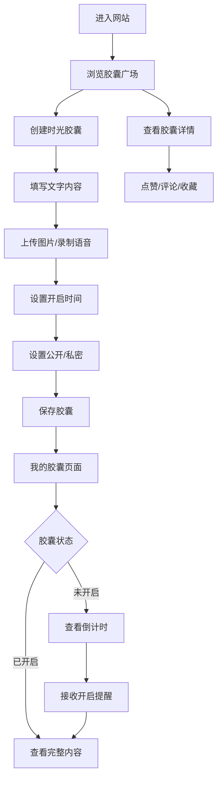

# 校园趣味时光胶囊网站 - PRD文档

## 1. Product Overview

校园趣味时光胶囊网站是一个面向高校在读大学生的轻量化情感分享平台，通过创建、分享、开启时光胶囊的方式，帮助用户记录校园回忆、许下未来期许、与好友建立情感约定。

- 解决大学生校园记忆留存难、情感表达形式单一的问题
- 目标用户为高校在读大学生，强调情感共鸣与社交互动
- 通过创意交互和治愈系设计，打造有温度的校园情感社区

## 2. Core Features

### 2.1 User Roles

| Role | Registration Method | Core Permissions |
|------|---------------------|------------------|
| 用户 | 游客体验/简单注册 | 创建胶囊、浏览广场、管理个人胶囊、互动评论 |

### 2.2 Feature Module

1. **首页/胶囊广场**: 公开胶囊展示、筛选排序、胶囊卡片浏览
2. **创建胶囊页**: 文字输入、图片上传、语音录制、开启时间设置、隐私设置
3. **我的胶囊页**: 未开启/已开启胶囊分类展示、胶囊详情查看、开启提醒
4. **胶囊详情页**: 完整内容查看、点赞/评论/收藏、互动功能

### 2.3 Page Details

| Page Name | Module Name | Feature description |
|-----------|-------------|---------------------|
| 胶囊广场 | 胶囊列表卡片 | 展示昵称（支持匿名）、剩余开启时间、主题标签、点赞/评论/收藏数 |
| 胶囊广场 | 筛选排序 | 按发布时间（最新/最早）、热度（点赞数高到低）排序 |
| 创建胶囊页 | 内容创作 | 10-500字文字输入、1-3张图片上传（JPG/PNG，≤5MB）、60秒内语音录制 |
| 创建胶囊页 | 时间设置 | 开启时间1天-365天，精确到小时，提供短期/中期/长期预设 |
| 创建胶囊页 | 隐私设置 | 公开/私密切换，公开胶囊展示在广场 |
| 我的胶囊页 | 分类展示 | 未开启胶囊（显示倒计时）、已开启胶囊（可查看内容） |
| 我的胶囊页 | 开启提醒 | 到期前1小时站内提醒 |
| 胶囊详情页 | 互动功能 | 点赞、评论、收藏胶囊 |

## 3. Core Process

### 主要用户流程
1. 用户进入网站，浏览胶囊广场的公开胶囊
2. 用户可以创建自己的时光胶囊，填写内容、上传素材、设置开启时间和隐私
3. 用户在"我的胶囊"页面管理自己的胶囊，查看倒计时和已开启的内容
4. 胶囊到期后，用户收到提醒并可以查看完整内容
5. 公开胶囊可以被其他用户点赞、评论、收藏

## 4. User Interface Design

### 4.1 Design Style

- **Primary Color**: 治愈系柔和粉色 (#FFE4E1)、天空蓝 (#87CEEB)、草绿 (#90EE90)
- **Secondary Color**: 奶油白 (#FFF8DC)、浅灰 (#F5F5F5)
- **Button Style**: 圆角矩形、柔和阴影、hover 时的轻微上浮效果
- **Font**: 主要使用 "Noto Sans SC" 搭配手写风格字体 "ZCOOL KuaiLe" 点缀
- **Layout Style**: 卡片式布局、充足留白、柔和渐变背景
- **Icon/Emoji Style**: 简约线性图标 + 温暖治愈的 emoji 元素

### 4.2 Page Design Overview

| Page Name | Module Name | UI Elements |
|-----------|-------------|-------------|
| 胶囊广场 | Hero 区域 | 温暖渐变背景、手写体标题、胶囊动画效果 |
| 胶囊广场 | 胶囊卡片 | 柔和阴影、圆角边框、倒计时数字动画、标签云 |
| 创建胶囊页 | 表单区域 | 分区表单、进度指示、温馨提示文案 |
| 创建胶囊页 | 时间选择 | 日历组件 + 滑动选择器、预设选项快捷按钮 |
| 我的胶囊页 | 分类标签 | Tab 切换、未开启胶囊突出显示倒计时 |
| 胶囊详情页 | 内容展示 | 图文混排、语音播放器、温馨的打开动画 |

### 4.3 Responsiveness

- Desktop-first 设计，完美适配桌面端
- 移动端自适应，针对触摸操作优化按钮大小和间距
- 响应式断点：1200px、768px、480px

### 4.4 动画与交互亮点

- 胶囊卡片有轻微的悬浮晃动效果，模拟真实胶囊
- 创建胶囊时有进度条动画
- 查看已开启胶囊时有"拆胶囊"的动画效果
- 倒计时数字有平滑的过渡动画
- 整体页面加载有淡入效果
