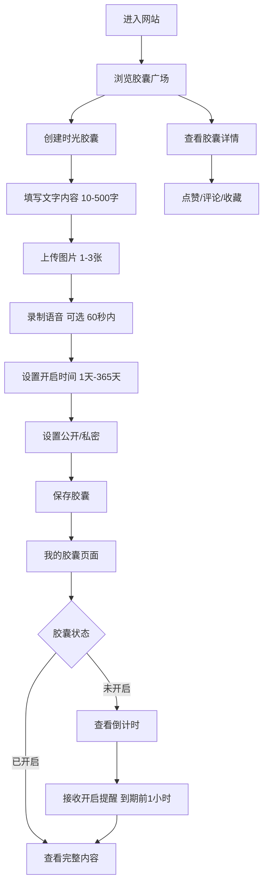

# 校园趣味时光胶囊网站 - 完整PRD文档

## 1. 产品概述

### 1.1 产品背景

校园趣味时光胶囊是一个专为高校在读大学生设计的轻量化情感分享平台，通过创建、分享、开启时光胶囊的方式，帮助用户记录校园回忆、许下未来期许、与好友建立情感约定。在快节奏的大学生活中，我们希望通过这个产品，为同学们创造一个可以珍藏美好瞬间、传递真挚情感的空间。

### 1.2 产品定位

- **服务对象**：高校在读大学生
- **核心定位**：轻量化、高趣味性、强情感共鸣
- **核心功能**：校园时光胶囊互动

### 1.3 解决的痛点

- 校园记忆留存难：大学生活中有许多珍贵瞬间，但缺乏方便的记录方式
- 情感表达形式单一：传统的文字记录难以承载丰富的情感
- 缺乏仪式感：时间匆匆流逝，缺少对未来的期许和约定

## 2. 核心功能

### 2.1 用户角色

| 角色 | 注册方式 | 核心权限 |
|------|---------|---------|
| 用户 | 游客体验/简单注册 | 创建胶囊、浏览广场、管理个人胶囊、互动评论 |

### 2.2 功能模块

1. **首页/胶囊广场**：公开胶囊展示、筛选排序、胶囊卡片浏览
2. **创建胶囊页**：文字输入、图片上传、语音录制、开启时间设置、隐私设置
3. **我的胶囊页**：未开启/已开启胶囊分类展示、胶囊详情查看、开启提醒
4. **胶囊详情页**：完整内容查看、点赞/评论/收藏、互动功能

### 2.3 页面详情

| 页面名称 | 模块名称 | 功能描述 |
|---------|---------|---------|
| 胶囊广场 | 胶囊列表卡片 | 展示昵称（支持匿名）、剩余开启时间、主题标签、点赞/评论/收藏数 |
| 胶囊广场 | 筛选排序 | 按发布时间（最新/最早）、热度（点赞数高到低）、即将开启排序 |
| 胶囊广场 | 热门标签 | 展示使用频率最高的标签，支持点击筛选 |
| 胶囊广场 | 时光盲盒 | 随机展示未开启胶囊，增加神秘感 |
| 创建胶囊页 | 内容创作 | 10-500字文字输入、1-3张图片上传（JPG/PNG，≤5MB）、60秒内语音录制 |
| 创建胶囊页 | 时间设置 | 开启时间1天-365天，精确到小时，提供短期/中期/长期预设 |
| 创建胶囊页 | 隐私设置 | 公开/私密切换，公开胶囊展示在广场，支持匿名发布 |
| 我的胶囊页 | 分类展示 | 未开启胶囊（显示倒计时，精确到分钟）、已开启胶囊（可查看内容） |
| 我的胶囊页 | 开启提醒 | 到期前1小时站内提醒 |
| 胶囊详情页 | 互动功能 | 点赞、评论、收藏胶囊 |

## 3. 核心流程

### 主要用户流程

1. 用户进入网站，浏览胶囊广场的公开胶囊
2. 用户可以创建自己的时光胶囊，填写内容、上传素材、设置开启时间和隐私
3. 用户在"我的胶囊"页面管理自己的胶囊，查看倒计时和已开启的内容
4. 胶囊到期后，用户收到提醒并可以查看完整内容
5. 公开胶囊可以被其他用户点赞、评论、收藏



## 4. 用户界面设计

### 4.1 设计风格

- **主色调**：治愈系柔和紫色 (#c8b6e2)、浅紫色 (#e8dff5)、淡粉色 (#f5f3f7)
- **辅助色**：米白色 (#f9f7f4)、白色 (#FFFFFF)
- **按钮风格**：圆角矩形、柔和阴影、hover 时的轻微上浮效果
- **字体**：主要使用 "Noto Sans SC" 搭配手写风格字体点缀
- **布局风格**：卡片式布局、充足留白、柔和渐变背景
- **图标风格**：简约线性图标 + 温暖治愈的 emoji 元素

### 4.2 页面设计概览

| 页面名称 | 模块名称 | UI 元素 |
|---------|---------|---------|
| 胶囊广场 | Hero 区域 | 温暖渐变背景、手写体标题、胶囊动画效果 |
| 胶囊广场 | 胶囊卡片 | 柔和阴影、圆角边框、倒计时数字动画、标签云 |
| 胶囊广场 | 时光盲盒 | 网格布局、神秘包装设计、随机抽取动画 |
| 胶囊广场 | 热门标签 | 标签云、点击高亮、清除筛选按钮 |
| 创建胶囊页 | 表单区域 | 分区表单、步骤指示器、温馨提示文案 |
| 创建胶囊页 | 时间选择 | 日期时间选择器 + 预设选项快捷按钮 |
| 我的胶囊页 | 分类标签 | Tab 切换、未开启胶囊突出显示倒计时 |
| 胶囊详情页 | 内容展示 | 图文混排、语音播放器、温馨的打开动画 |

### 4.3 响应式设计

- 移动端优先设计，完美适配手机端
- 桌面端自适应，提供更好的浏览体验
- 响应式断点：320px、480px、768px、1024px
- 触摸操作优化：按钮尺寸≥44x44px，间距≥8px

### 4.4 动画与交互亮点

- 胶囊卡片有轻微的悬浮晃动效果，模拟真实胶囊
- 创建胶囊时有进度条动画
- 查看已开启胶囊时有"拆胶囊"的动画效果
- 倒计时数字有平滑的过渡动画
- 整体页面加载有淡入效果
- 时光盲盒有随机抽取的动画

## 5. 功能详细规格

### 5.1 时光胶囊创建功能

#### 5.1.1 文字内容

- **字数限制**：10-500字
- **输入方式**：多行文本框
- **实时计数**：显示当前字数/500
- **验证逻辑**：
  - 少于10字：提示"请输入至少10字内容"
  - 超过500字：阻止继续输入
- **占位符提示**："请输入回忆内容..."

#### 5.1.2 图片上传

- **数量限制**：1-3张
- **格式限制**：JPG、PNG
- **大小限制**：单张图片≤5MB
- **上传方式**：点击选择或拖拽上传
- **图片预览**：上传后立即显示预览
- **删除功能**：支持删除已上传图片
- **验证逻辑**：
  - 未上传图片：提示"请至少上传1张图片"
  - 超过3张：阻止继续上传
  - 格式不支持：提示"只支持JPG和PNG格式"
  - 大小超限：提示"单张图片不能超过5MB"

#### 5.1.3 语音录制

- **时长限制**：60秒内
- **录制状态**：显示录制时长、音量波形
- **播放功能**：支持预览录制的语音
- **删除功能**：支持删除已录制的语音
- **麦克风权限**：友好的权限请求和错误提示
- **可选性**：语音录制为可选功能

#### 5.1.4 开启时间设置

- **时间范围**：1天-365天
- **精度**：精确到小时
- **预设选项**：
  - 短期：1天、3天、7天
  - 中期：1个月、2个月、3个月
  - 长期：6个月、12个月
- **自定义设置**：支持手动选择日期和时间
- **验证逻辑**：
  - 不能设置过去的时间
  - 不能设置少于1天或超过365天的时间

#### 5.1.5 隐私设置

- **公开模式**：胶囊展示在胶囊广场，所有用户可见
- **私密模式**：仅用户本人可见
- **匿名发布**：公开模式下支持匿名发布，其他用户无法看到昵称
- **切换方式**：清晰的按钮切换，有明确的描述

### 5.2 胶囊广场功能

#### 5.2.1 胶囊卡片展示

- **展示内容**：
  - 发布人昵称（匿名时显示"匿名用户"）
  - 剩余开启时间（精确到天）
  - 胶囊主题标签（1-3个）
  - 点赞/评论/收藏数量
  - 胶囊封面图片
- **交互**：点击卡片进入详情页

#### 5.2.2 排序方式

- **最新发布**：按创建时间倒序
- **最热门**：按点赞数倒序
- **即将开启**：按开启时间升序
- **切换方式**：清晰的标签切换

#### 5.2.3 热门标签

- **统计方式**：统计所有公开胶囊的标签使用频率
- **展示数量**：Top 5
- **交互**：点击标签筛选包含该标签的胶囊
- **清除筛选**：支持清除标签筛选

#### 5.2.4 时光盲盒

- **展示内容**：随机展示3个未开启的公开胶囊
- **刷新功能**：支持"换一批"刷新
- **神秘感**：只显示盲盒简介和开启时间，不显示完整内容

### 5.3 我的胶囊功能

#### 5.3.1 分类展示

- **未开启胶囊**：
  - 显示倒计时（精确到小时、分钟）
  - 倒计时动画效果
  - 到期前高亮提醒
- **已开启胶囊**：
  - 显示"已开启"标识
  - 可直接查看完整内容
- **Tab切换**：清晰的标签切换

#### 5.3.2 开启提醒

- **提醒时间**：开启时间到期前1小时
- **提醒方式**：站内通知
- **通知内容**："您的时光胶囊即将开启！"
- **跳转链接**：点击通知可直接跳转到胶囊详情页

### 5.4 胶囊详情功能

#### 5.4.1 内容展示

- **未开启胶囊**：
  - 显示倒计时
  - 显示盲盒简介（如果有）
  - 无法查看完整内容
- **已开启胶囊**：
  - 完整展示文字内容
  - 展示所有图片
  - 语音播放器
  - "拆胶囊"动画效果

#### 5.4.2 互动功能

- **点赞**：点击心形图标，点赞数+1
- **评论**：输入评论内容，发布评论
- **收藏**：点击星形图标，收藏数+1
- **交互反馈**：点击时有明确的视觉反馈

## 6. 技术规格

### 6.1 前端技术栈

- **框架**：React 18
- **语言**：TypeScript
- **构建工具**：Vite
- **样式**：Tailwind CSS
- **状态管理**：Zustand
- **路由**：React Router DOM
- **图标**：Lucide React

### 6.2 核心功能技术实现

#### 6.2.1 图片上传

- 使用 File API 处理文件选择
- 图片压缩：使用 Canvas 进行客户端压缩
- 图片预览：使用 URL.createObjectURL
- 格式验证：检查文件扩展名和 MIME 类型
- 大小验证：检查文件 size 属性

#### 6.2.2 语音录制

- 使用 Web Audio API 和 MediaRecorder API
- 麦克风权限请求：使用 navigator.mediaDevices.getUserMedia
- 录音时长控制：使用 setTimeout 或 requestAnimationFrame
- 录音预览：使用 Audio 元素播放

#### 6.2.3 倒计时

- 使用 setInterval 定时更新
- 计算剩余时间：目标时间 - 当前时间
- 格式化显示：天、小时、分钟
- 动画过渡：使用 CSS transition

#### 6.2.4 数据存储

- 使用 LocalStorage 进行前端数据持久化
- 数据结构：JSON 格式
- 数据备份：定期保存到 LocalStorage

### 6.3 性能优化

- 图片懒加载
- 组件按需渲染
- 防抖和节流
- 虚拟滚动（长列表）

## 7. 数据模型

### 7.1 用户 (User)

```typescript
interface User {
  id: string;
  nickname: string;
  avatar?: string;
}
```

### 7.2 胶囊 (Capsule)

```typescript
interface Capsule {
  id: string;
  userId: string;
  content: string;           // 10-500字
  images: string[];          // 1-3张
  audio?: string;            // 可选，60秒内
  openAt: string;            // 1天-365天
  isPublic: boolean;
  isAnonymous: boolean;
  tags: string[];            // 1-3个
  likes: number;
  comments: number;
  favorites: number;
  createdAt: string;
}
```

### 7.3 评论 (Comment)

```typescript
interface Comment {
  id: string;
  capsuleId: string;
  userId: string;
  nickname: string;
  content: string;
  createdAt: string;
}
```

### 7.4 通知 (Notification)

```typescript
interface Notification {
  id: string;
  title: string;
  message: string;
  type: 'capsule_opened' | 'capsule_soon' | 'system';
  read: boolean;
  createdAt: string;
  capsuleId?: string;
}
```

## 8. 开发标准

### 8.1 代码规范

- 使用 TypeScript 严格模式
- 组件命名：PascalCase
- 文件命名：PascalCase（组件），camelCase（工具）
- 提交规范：清晰的提交信息

### 8.2 测试要求

- 单元测试：核心逻辑
- 集成测试：用户流程
- 兼容性测试：主流浏览器

### 8.3 部署要求

- 构建产物：优化后的静态文件
- 性能指标：Lighthouse 评分 ≥ 90
- 响应式：完美适配各设备

## 9. 创意亮点

### 9.1 时光记忆

- **仪式感**：通过设定开启时间，让回忆具有期待感
- **多维记录**：文字、图片、语音结合，全方位记录
- **时间盲盒**：未开启的胶囊像盲盒一样，增加神秘感

### 9.2 情感共鸣

- **校园主题**：专为大学生设计，贴近校园生活
- **好友互动**：点赞、评论、收藏，促进情感交流
- **匿名发布**：保护隐私，让用户更自由地表达

### 9.3 治愈设计

- **柔和配色**：紫色系配色，温暖治愈
- **流畅动画**：自然的过渡效果，提升体验
- **充足留白**：简洁的界面，减少视觉压力

## 10. 后续迭代方向

- 后端服务：真实的服务器和数据库
- 社交功能：好友系统、私信功能
- 更多模板：丰富的胶囊模板选择
- 数据分析：用户行为分析、数据统计
- 多端适配：小程序、App 等