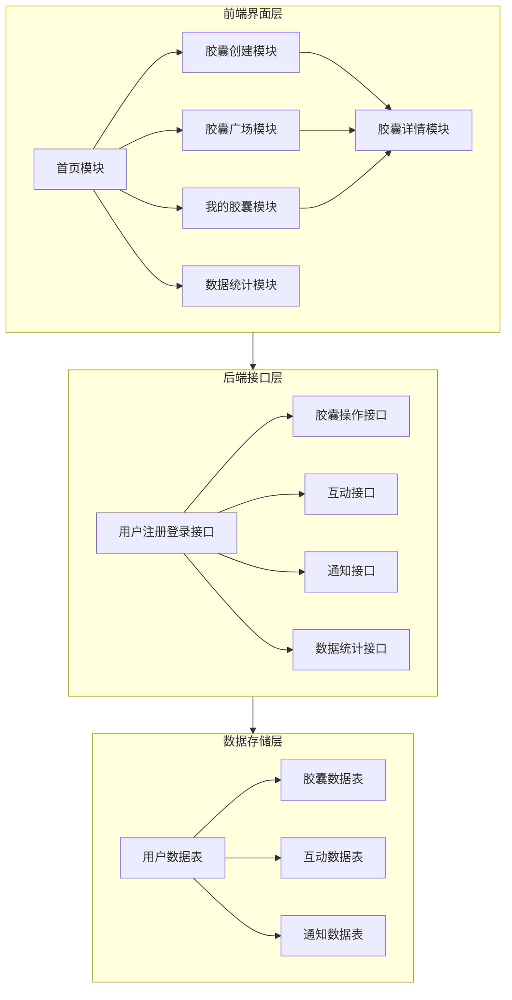

# 校园时光胶囊网站架构图

## 1. 系统架构概览

## 2. 模块详细说明

### 2.1 前端界面模块

| 模块名称 | 核心职责 | 技术实现 |
|---------|---------|--------|
| 首页模块 | 网站入口，核心功能导航，搜索功能 | React 18 + TypeScript + Tailwind CSS |
| 胶囊创建模块 | 时光胶囊创建（文本、图片、语音），公开/私密设置，密码保护，指定好友查看 | React 18 + TypeScript + Web Audio API + File API |
| 胶囊广场模块 | 时光胶囊展示，时间盲盒，热门标签，分页功能 | React 18 + TypeScript + Zustand |
| 我的胶囊模块 | 个人胶囊管理，胶囊状态查看，编辑功能 | React 18 + TypeScript + Zustand |
| 数据统计模块 | 核心数据统计，数据可视化，Excel导出 | React 18 + TypeScript + 数据可视化 |
| 胶囊详情模块 | 胶囊内容展示，互动功能（点赞、评论、收藏），密码验证 | React 18 + TypeScript + Zustand |

### 2.2 后端接口模块

| 模块名称 | 核心职责 | 技术实现 |
|---------|---------|--------|
| 用户注册登录接口 | 用户注册、登录、身份验证 | Node.js + Express + JWT |
| 胶囊操作接口 | 胶囊创建、修改、删除、查询 | Node.js + Express + MongoDB |
| 互动接口 | 点赞、评论、收藏功能 | Node.js + Express + MongoDB |
| 通知接口 | 胶囊开启通知、互动通知、微信通知 | Node.js + Express + 消息队列 |
| 数据统计接口 | 数据汇总、统计分析、导出功能 | Node.js + Express + MongoDB + Excel生成 |

### 2.3 数据存储模块

| 模块名称 | 核心职责 | 技术实现 |
|---------|---------|--------|
| 用户数据表 | 存储用户基本信息、登录凭证、微信绑定信息 | MongoDB |
| 胶囊数据表 | 存储胶囊内容、创建时间、开启时间、状态等信息 | MongoDB |
| 互动数据表 | 存储用户互动记录（点赞、评论、收藏） | MongoDB |
| 通知数据表 | 存储通知内容、状态、发送时间等信息 | MongoDB |

## 3. 技术栈

- **前端**：React 18 + TypeScript + Vite + Tailwind CSS + Zustand + React Router DOM
- **后端**：Node.js + Express + MongoDB + JWT + Socket.io
- **工具**：Lucide React（图标库）、Web Audio API（语音录制）、File API（文件处理）

## 4. 核心流程

1. **用户注册/登录流程**：用户填写注册信息 → 后端验证 → 生成JWT token → 前端存储token → 登录状态管理

2. **胶囊创建流程**：用户填写胶囊内容 → 上传附件（图片、语音） → 设置开启时间和权限 → 后端存储 → 前端展示创建成功

3. **胶囊查看流程**：用户访问胶囊详情 → 后端验证权限 → 前端展示内容 → 记录互动数据

4. **数据统计流程**：用户访问数据看板 → 后端汇总数据 → 前端可视化展示 → 支持导出功能

## 5. 系统特点

- **响应式设计**：适配移动端和桌面端
- **模块化架构**：各模块职责清晰，易于维护和扩展
- **数据持久化**：使用LocalStorage进行前端数据存储，模拟后端数据
- **用户友好**：直观的界面设计，流畅的交互体验
- **安全可靠**：密码保护、权限控制、错误处理